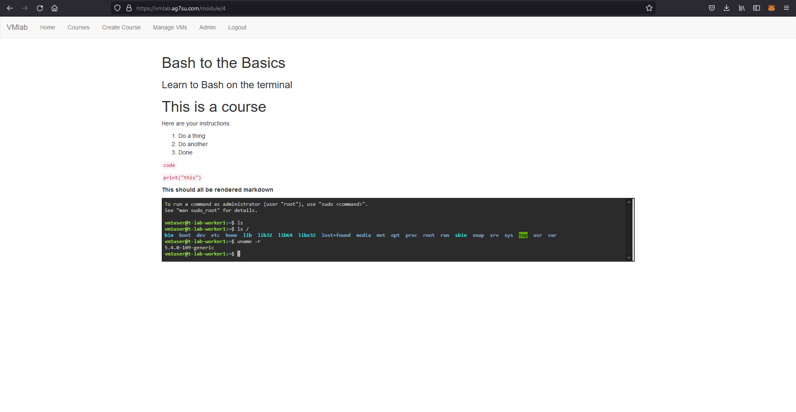

# VMLab
A frontend for my VM lab

I like teaching people things, almost as much as I like learning things. VMLab will hopefully serve both of those goals. 

VMLab started from a need for a way for me to spin up, manage, and share VM instances with friends who I might want to teach a skill to.

The design goal is:

1. An admin can create Terraform/Ansible scripts to specify a class VM layout
2. A teacher can fairly easily write a quick page of instructions and associate it with a VM type
3. The admin can assign students to courses
4. VMLab manages my Proxmox host and a couple firewalls to:
     - Make sure there are enough VMs and they're assigned one per student
     - Provision VMs with unguessable but procedural passwords
     - NAT distinct SSH ports for each VM instance through my inner and outer firewalls
     - Reverse proxy a HTTP terminal program running on each VM and iframe this into the correct student's course page

With this setup a 'student' can log into their account, choose an active course that they're assigned to, log into the VM they're assigned for that course and follow the directions provided by the 'teacher'

The VMs I currently have set up all have tmux installed by default, so a teacher can ssh into the student's instance and share their terminal if the student gets stuck

This is a work in progress, and is mostly a proof of concept and an excuse for me to learn Terraform and Ansible.

What works:
- Most of the web part
- Database, creating accounts, assigning roles, adding VMs; Courses; Course assignments
- VMs are created and assigned
- Firewalls, HAProxy, VMs are configured appropriately

What Doesn't:
- 'Flexing' the number of VMs
- Some database orphaning issues/mismatch of deleted records/actual VMs

This is a personal project, and isn't meant for other people to try to replicate. 

More to come as I find time to work on this. 
